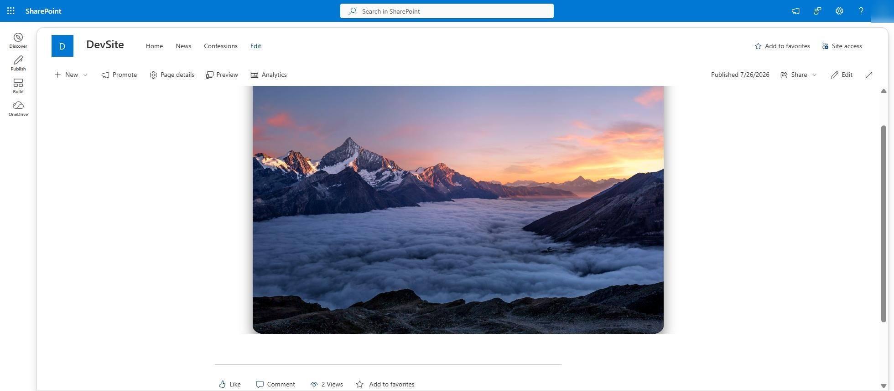
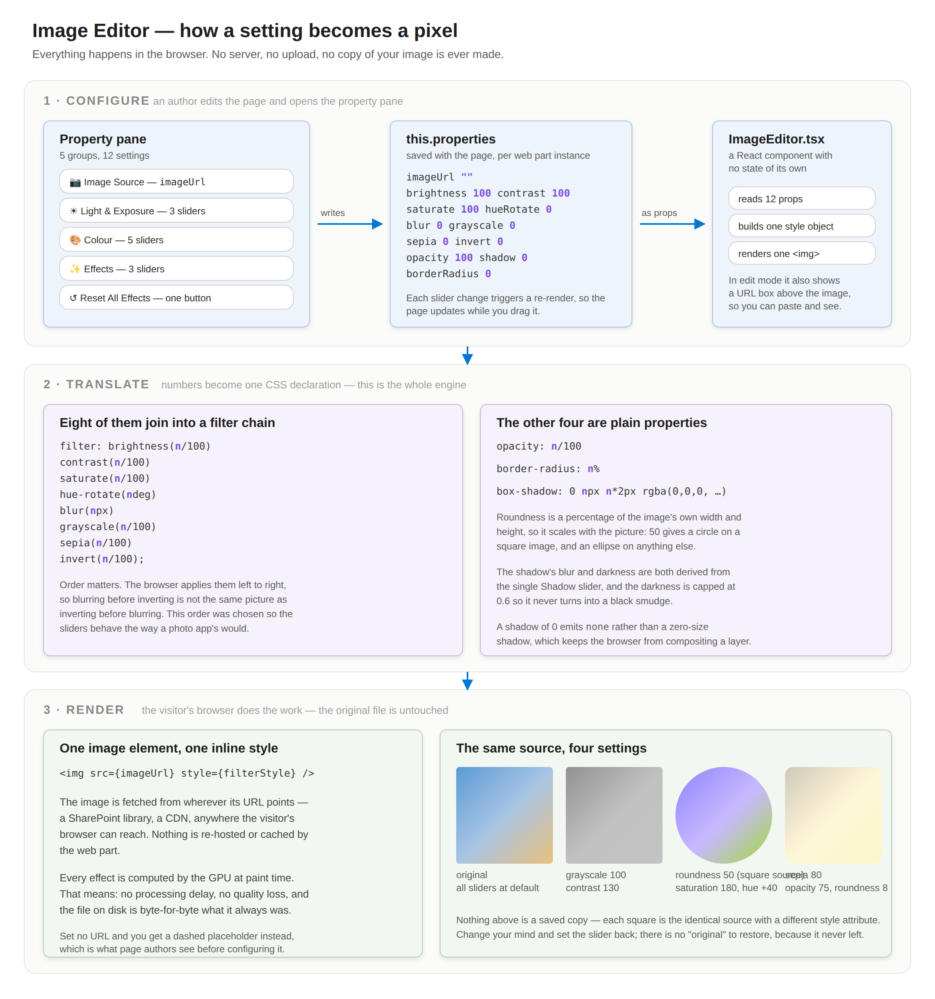
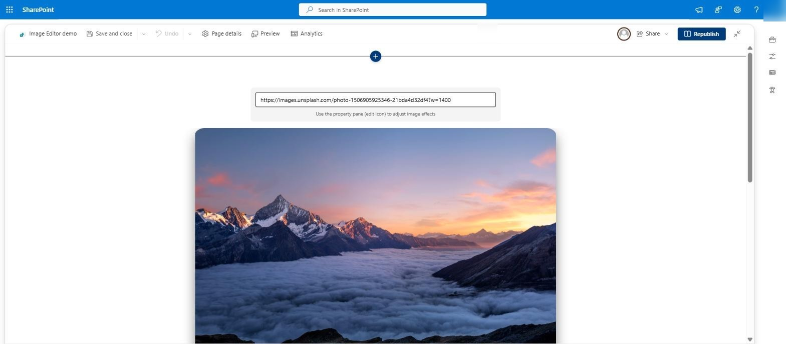
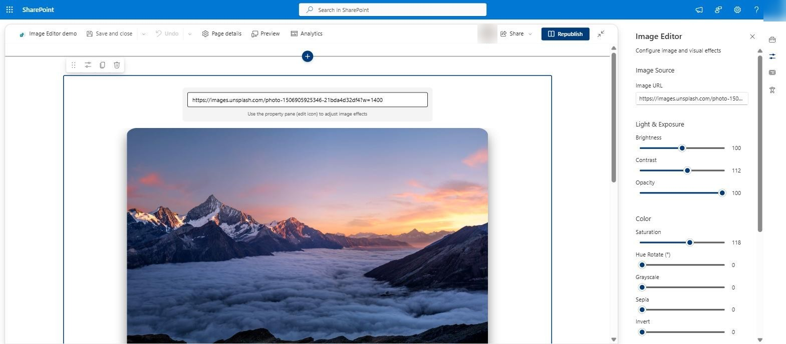
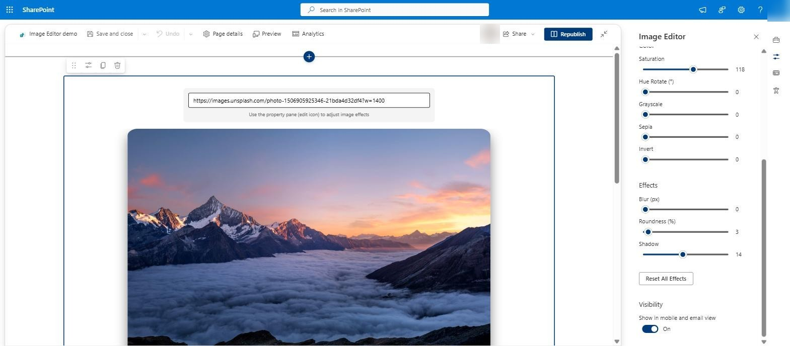
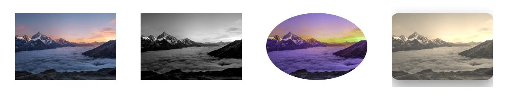
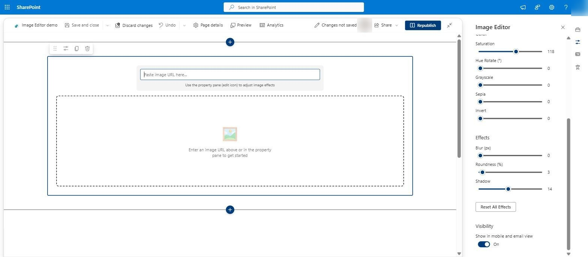

<div align="center">

# 🖼️ Image Editor

**A SharePoint web part that lets you restyle any image from the property pane — and never touches the original file.**

Brightness, contrast, saturation, hue, blur, sepia, invert, opacity, roundness, shadow.
Drag a slider, watch the page update. Nothing is uploaded, processed or re-saved.

[](https://github.com/jgalili/sharepoint-image-editor/actions/workflows/build.yml)
[](LICENSE)
[](https://learn.microsoft.com/sharepoint/dev/spfx/sharepoint-framework-overview)
[](https://nodejs.org)
[](#-whats-actually-in-here)



</div>

---

## 🤔 Why this exists

SharePoint's built-in Image web part will crop your picture and let you pick a filter from a
short fixed list. If you want the header photo on your intranet page a little warmer, or the
team portrait softened, or a logo knocked back to 40% so text reads over it, your options are
to edit the file in something else and re-upload it — and now you have two copies, and the one
in the library is the wrong one.

This web part takes a different line: **the image is never modified.** Everything you see is a
CSS declaration computed in the visitor's browser at paint time. Change your mind and drag the
slider back; there is no "original" to restore, because it never left.

---

## 🗺️ How it works

<div align="center">

</div>

> The editable source for this diagram is [`docs/images/how-it-works.svg`](docs/images/how-it-works.svg).

The entire engine is this, in `ImageEditor.tsx`:

```ts
filter: [
  `brightness(${brightness / 100})`, `contrast(${contrast / 100})`,
  `saturate(${saturate / 100})`,     `hue-rotate(${hueRotate}deg)`,
  `blur(${blur}px)`,                 `grayscale(${grayscale / 100})`,
  `sepia(${sepia / 100})`,           `invert(${invert / 100})`
].join(' ')
```

Eight sliders join into one `filter` chain; the other four (opacity, roundness, shadow, and the
image URL itself) are ordinary CSS. That's the whole thing. There is no canvas, no image
processing library, no server call, and no runtime dependency beyond React and the SharePoint
Framework itself.

---

## 📸 What it looks like

### View mode — just the picture

Visitors see the styled image and nothing else. No toolbar, no chrome, no hint that it's
configurable.


### Edit mode — paste a URL and see it immediately

While the page is in edit mode the web part grows a URL box, so you can try an image without
opening the property pane at all.



### The property pane — five groups, twelve settings

Image Source, Light & Exposure, Colour, Effects, and a Reset button that puts all eleven
sliders back where they started.





### One photograph, four settings

Nothing below is a saved copy. It's the same file four times, with a different style attribute
each time — left to right: untouched; greyscale 100 with contrast 135; saturation 175, hue +35
and roundness 50; sepia 85 with brightness 110, opacity 80 and a shadow.



### Before anything is configured

Drop the web part on a page and it tells you what it wants, rather than rendering nothing.



---

## ✨ What you get

|  | |
|---|---|
| 🎚️ **Twelve live controls** | Brightness, contrast, opacity, saturation, hue, greyscale, sepia, invert, blur, roundness, shadow — plus the image URL. |
| 🪞 **Non-destructive, always** | The file in your library is byte-for-byte untouched. The effects are a style attribute, nothing more. |
| ⚡ **Nothing to wait for** | No upload, no round trip, no processing. The GPU does it at paint time. |
| ↺ **One-click reset** | Every effect back to default, without hunting through twelve sliders. |
| 🎨 **Themed** | Colours come from SharePoint theme tokens, so it follows whatever theme the site is using. |
| 👥 **Works in Teams too** | Ships as a Teams tab and personal app as well as a SharePoint web part. |

---

## 🚀 Getting started

**If you just want to use it:** grab `image-editor-webpart.sppkg` from the
[latest build](https://github.com/jgalili/sharepoint-image-editor/actions/workflows/build.yml)
(open the newest green run, download the artifact), then jump to step 3 below.

**If you want to build it yourself**, you need **Node 18** — SPFx 1.20 will refuse newer
versions. [nvm](https://github.com/nvm-sh/nvm) or
[nvm-windows](https://github.com/coreybutler/nvm-windows) makes that painless.

```bash
# 1. build
git clone https://github.com/jgalili/sharepoint-image-editor.git
cd sharepoint-image-editor
npm install
npm run package        # → sharepoint/solution/image-editor-webpart.sppkg
```

```
# 2. upload
Go to https://<your-tenant>.sharepoint.com/sites/appcatalog
  → "Apps for SharePoint" → drag the .sppkg in
  → tick "Make this solution available to all sites" → Deploy
```

```
# 3. use it
Open any SharePoint page → Edit → + → search for "Image Editor"
  → paste an image URL → open the property pane (pencil icon) → play
```

No permissions to approve, no Azure resources, no tenant configuration. It's a web part that
renders an `` tag.

---

## 🧭 What's actually in here

```
src/webparts/imageEditor/
  ImageEditorWebPart.ts          the web part: 12 properties, the property pane, the reset button
  components/ImageEditor.tsx     a stateless React component that builds the style and renders the img
  components/*.scss              themed styles
  loc/                           strings (en-us only — translations welcome)
config/                          standard SPFx build configuration
teams/                           Teams app icons
docs/images/                     the diagram and the screenshots above
```

Four source files, about 250 lines of TypeScript between them.

---

## 🙅 Honest limitations

- **The alt text is a fixed string.** That's not good enough for real accessibility, and it
  should be a configurable property. See [CONTRIBUTING.md](CONTRIBUTING.md) — it's the first
  thing on the list.
- **You paste a URL; there's no picker.** It would be much nicer to browse the site's own
  document libraries. Also on the list.
- **The image must be reachable by the visitor's browser.** A link to a library only they can
  read will render for you and break for them. Same rule as any `` on the web.
- **No crop or rotate.** The effects are all CSS filters, and cropping isn't one.
- **Roundness is a percentage, so it follows the image's shape.** 50 gives a circle on a square
  photo and an ellipse on a landscape one — which is either exactly what you wanted or a
  surprise, depending on the picture.
- **Very large blur values on very large images can make scrolling stutter** on low-end
  hardware — the browser is compositing a blurred layer on every frame. Blur 20 on a 4000px
  photo is asking a lot.
- **Not an image editor in the Photoshop sense.** It restyles how one picture is displayed in
  one place on one page. That's deliberately the whole scope.

---

## 🤝 Contributing

Issues and pull requests are welcome — see [CONTRIBUTING.md](CONTRIBUTING.md) for the setup and
a list of things that would genuinely help. Configurable alt text, an image picker, preset
looks and localisation are all wide open.

## 📄 Licence

[MIT](LICENSE) — do what you like with it.
